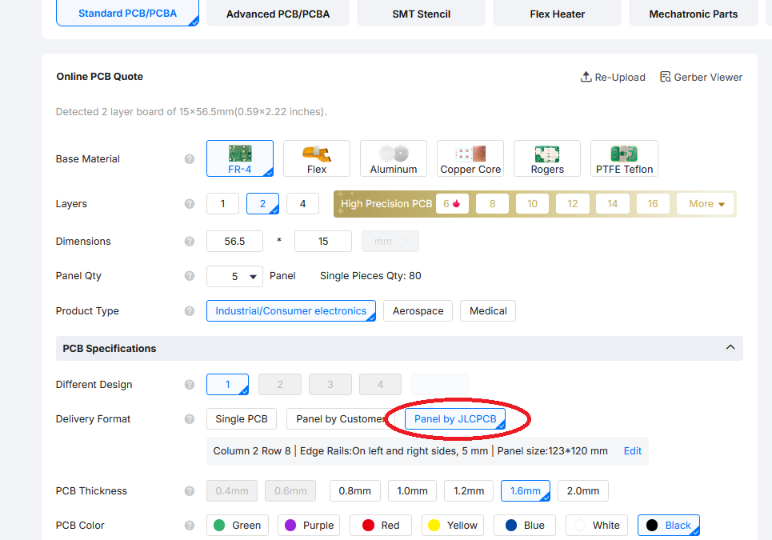
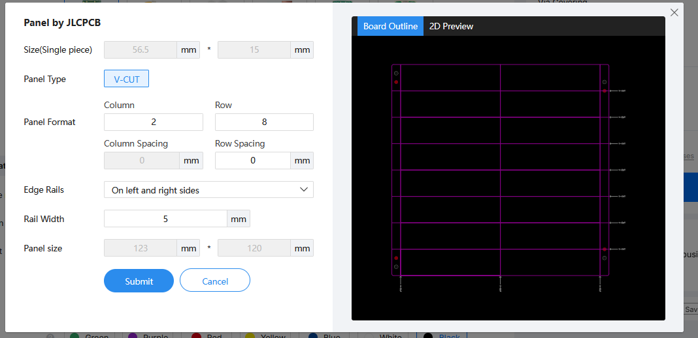
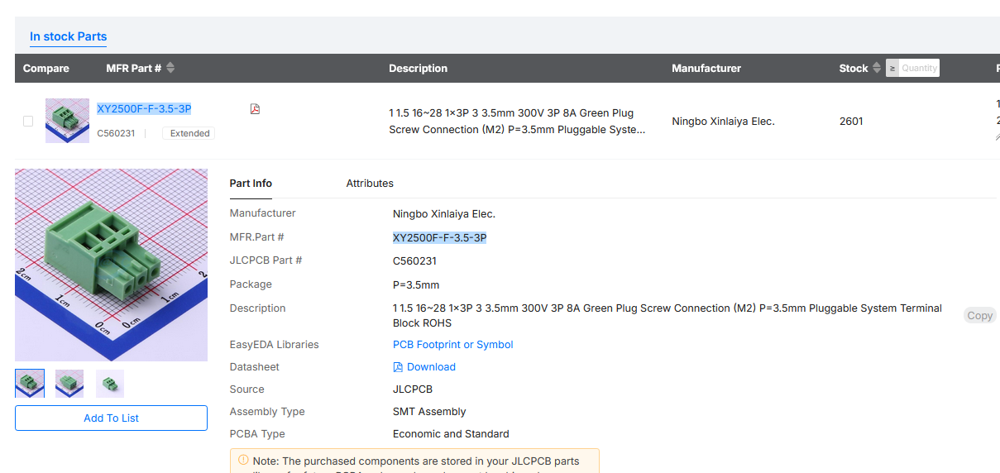

> 🌐 &nbsp; [🇬🇧 EN](Manual-EN.md) &nbsp;|&nbsp; [🇩🇪 DE](Manual-DE.md) &nbsp;|&nbsp; [🇫🇷 FR](Manual-FR.md) &nbsp;|&nbsp; [🇳🇱 NL](Manual-NL.md) &nbsp;|&nbsp; [🇪🇸 ES](Manual-ES.md) &nbsp;|&nbsp; 🇮🇹 IT &nbsp;|&nbsp; [🇵🇱 PL](Manual-PL.md) &nbsp;|&nbsp; [🇨🇿 CS](Manual-CS.md) &nbsp;|&nbsp; [🇩🇰 DA](Manual-DA.md) &nbsp;|&nbsp; [🇳🇴 NO](Manual-NO.md) &nbsp;|&nbsp; [🇸🇪 SV](Manual-SV.md) &nbsp;|&nbsp; [🇭🇺 HU](Manual-HU.md) &nbsp;|&nbsp; [🇵🇹 PT](Manual-PT.md)

# Manuale Moduli OS-relays

## Introduzione

Questo documento descrive i moduli relè OS utilizzati nei progetti di Open Source Model
Railway Electronics: - **OS-General-Purpose-Relay** (modulo relè doppio) - **OS-Latching-Relay** (modulo relè bistabile singolo)

Entrambi i tipi di relè esistono in versione **THT** e **SMD** e possono essere
inseriti direttamente nei decoder OS oppure utilizzati in modo autonomo.

------------------------------------------------------------------------

## 1. OS-General-Purpose-Relay

Il modulo OS-General-Purpose-Relay contiene **due relè monostabili**,
ciascuno con: - **1× Comune (COM)** - **1× Normalmente aperto (NO)** - **1×
Normalmente chiuso (NC)**

*Contatti dei relè a uso generale*

*OS-General-Purpose-Relay — versione THT*

*OS-General-Purpose-Relay — versione SMD*

### Caratteristiche

-   Compatibile con **OS-Solenoid-Decoder** e **OS-Servo-Decoder**
-   Adatto per:
    -   Commutazione di accessori (luci, segnali, animazioni)
    -   Polarizzazione del frog degli scambi **Electrofrog**
    -   Polarizzazione del frog degli scambi **Unifrog**
    -   **Binari di sezionamento con routing di alimentazione**

### Esempi di Utilizzo

-   Commutazione dell'alimentazione verso sezioni di binario isolate
-   Creazione di commutazione automatica della polarità del frog
-   Controllo di elettronica esterna come LED, campanelli o motori
-   Configurazioni di scambi con routing di alimentazione

------------------------------------------------------------------------

## 2. OS-Latching-Relay

L'OS-Latching-Relay è un **relè bistabile (a mantenimento) singolo**.\
**Rimane nell'ultima posizione senza alimentazione continua**.

*OS-Latching-Relay — versione THT*

*OS-Latching-Relay — versione SMD*

### Note Importanti

-   Non può essere utilizzato per scambi **Electrofrog**\
    (l'electrofrog richiede un cambio di polarità continuo e non a mantenimento)
-   Funziona perfettamente con gli scambi **Unifrog**
-   La bobina del relè può essere collegata **in parallelo** con la bobina solenoide dello scambio; non richiede decoder aggiuntivi

### Casi d'Uso con Decoder DCC

-   **Polarizzazione del frog Unifrog**
-   Scambi autogestiti / routing di alimentazione
-   Commutazione di accessori
-   Funzionamento autonomo con qualsiasi decoder per solenoidi

------------------------------------------------------------------------

## 3. Utilizzo dei Relè con i Decoder OS

### Con OS-Solenoid-Decoder

-   Supporta entrambi:
    -   OS-General-Purpose-Relay\
    -   OS-Latching-Relay (solo per Unifrog)

### Con OS-Servo-Decoder

-   Supporta solo:
    -   **OS-General-Purpose-Relay**
-   Utilizzi tipici:
    -   Commutazione della polarità del frog
    -   Commutazione di accessori

------------------------------------------------------------------------

## 4. Utilizzo Autonomo

Entrambi i moduli relè possono essere utilizzati senza i decoder OS.

### Requisiti

-   Un segnale di controllo a livello logico 5V
-   Alimentazione adatta al tipo di relè
-   Qualsiasi microcontrollore, Arduino o decoder di terze parti in grado di
    pilotare un piccolo relè

### Applicazioni Autonome Tipiche

-   Commutazione di LED o segnali
-   Routing di alimentazione nei sezionamenti
-   Controllo della polarità del frog nei moduli di scambio
-   Compiti di automazione a bassa corrente

------------------------------------------------------------------------

## Tabella Riassuntiva

| Tipo di Relè                 | Unifrog | Electrofrog | Commutazione Accessori | Sezionamenti Autogestiti | Funziona Con               |
|---------------------------|---------|-------------|----------------------|------------------------|--------------------------|
| **OS-General-Purpose-Relay** | ✔       | ✔           | ✔                    | ✔                      | Decoder Servo + Solenoide |
| **OS-Latching-Relay**        | ✔       | ✖           | ✔                    | ✔                      | Solo Decoder Solenoide     |

------------------------------------------------------------------------

## Esempi di Cablaggio

*Decoder OS-Solenoid con 8 OS-latching-relay inseriti*

*Relè OS-General-Purpose cablato all'OS-Solenoid-Decoder per scambi Electrofrog*

*Relè OS-General-Purpose collegato all'OS-Servo-Decoder per scambi Unifrog*

*Relè OS-General-Purpose collegato all'OS-Servo-Decoder per scambi Electrofrog*

## 5. Istruzioni aggiuntive per l'ordine del PCB

Tutti gli OS-Relays sono stati progettati in modo da poter essere ordinati in cosiddetti pannelli. Quando vengono ordinati in pannelli, hanno le stesse distanze dei socket dei decoder OS. I PCB possono anche essere ordinati come unità separate sciolte, ma in pannelli il costo per unità è inferiore.

Per ordinarli come pannello occorre fare clic su **Panel by JLCPCB** accanto a **Delivery format**. Si aprirà una nuova finestra in cui è necessario impostare il numero di colonne e righe. Esistono 2 regole:

- JLCPCB richiede che i pannelli abbiano dimensioni superiori a 70x70 mm; i relè sono lunghi circa 50 mm e larghi 15 mm.
- Se devono essere utilizzati in combinazione con decoder OS Solenoid o servo, è consigliabile avere gruppi di 4 unità, anche se non è obbligatorio.

Per soddisfare il primo requisito servono almeno pannelli di 2 righe e 5 colonne. Per soddisfare il secondo requisito si consiglia di aumentare a 8 colonne. Questo fornisce di fatto 4 set.

Se ordinare pannelli o PCB separati dipende anche dalla quantità desiderata. Il quantitativo minimo d'ordine è 5 unità. Quindi possono essere 5 relè oppure 5 pannelli da 10 a 16 moduli relè ciascuno. È sempre possibile verificare il prezzo incluso la spedizione nell'ultimo passaggio, prima di pagare. È quindi possibile interrompere l'ordine in qualsiasi momento.

*Layout del pannello — guide laterali a sinistra e a destra*

*Impostazioni di configurazione del pannello in JLCPCB*

### Versione SMD — componente aggiuntivo necessario

La versione SMD utilizza un **connettore a morsetto verticale** che non viene posizionato dal servizio di assemblaggio SMT. Questo connettore deve essere ordinato separatamente e saldato a mano.

- **Parte:** XY2500F-F-3.5-3P
- **Numero parte LCSC:** C560231

*Connettore a morsetto verticale — XY2500F-F-3.5-3P (C560231)*

Quando si effettua un ordine di assemblaggio SMT su JLCPCB, aggiungere la seguente nota nel campo **Special PCB Remarks**:

> Il componente C560231 deve essere inserito nel connettore verticale.

JLCPCB vi contatterà dopo l'ordine e addebiterà una piccola tariffa aggiuntiva per questo posizionamento manuale.

---

Per ulteriori istruzioni sull'ordine di PCB, vedere [qui](https://github.com/Open-Source-Model-Railway-Electronics/docs/blob/master/Ordering_bare_PCB/Ordering_bare_PCB-EN.md) per le schede nude e [qui](https://github.com/Open-Source-Model-Railway-Electronics/docs/blob/master/Ordering_SMT_ASSEMBLED_PCB/Ordering_Assembled_PCBs_JLCPCB-EN.md) per le schede assemblate SMT
