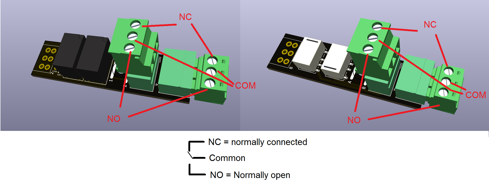
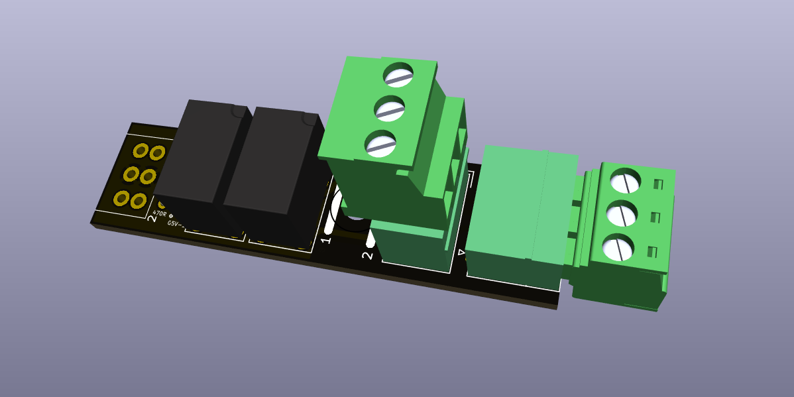
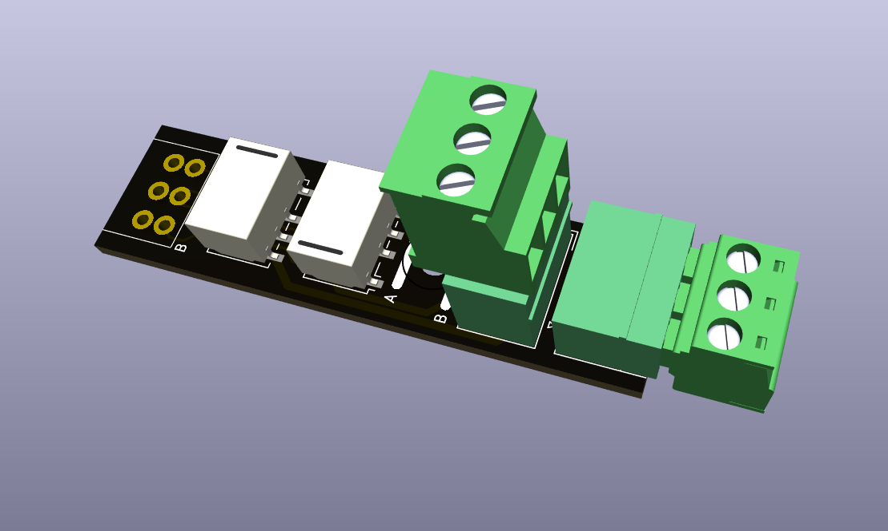
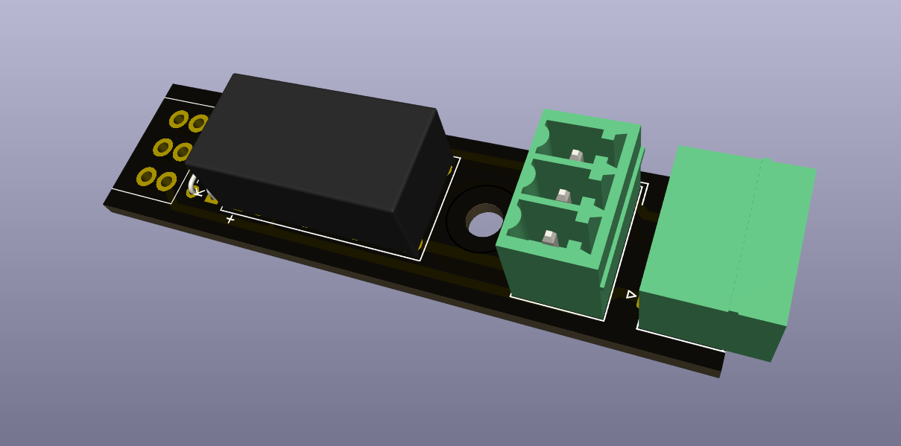
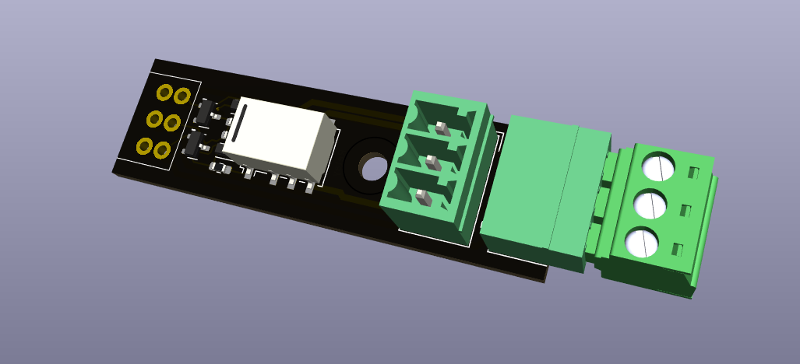
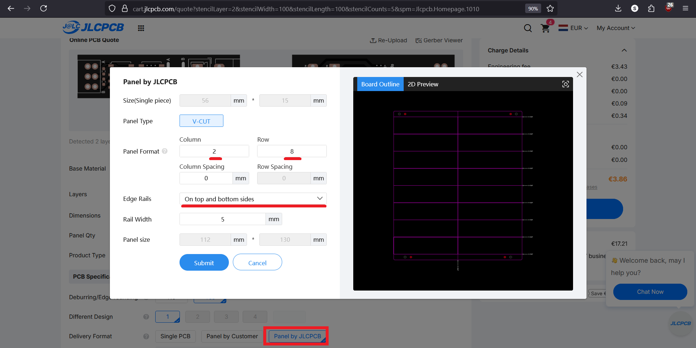

> 🌐 &nbsp; [🇬🇧 EN](Manual-EN.md) &nbsp;|&nbsp; [🇩🇪 DE](Manual-DE.md) &nbsp;|&nbsp; [🇫🇷 FR](Manual-FR.md) &nbsp;|&nbsp; [🇳🇱 NL](Manual-NL.md) &nbsp;|&nbsp; [🇪🇸 ES](Manual-ES.md) &nbsp;|&nbsp; [🇮🇹 IT](Manual-IT.md) &nbsp;|&nbsp; [🇵🇱 PL](Manual-PL.md) &nbsp;|&nbsp; [🇨🇿 CS](Manual-CS.md) &nbsp;|&nbsp; [🇩🇰 DA](Manual-DA.md) &nbsp;|&nbsp; [🇳🇴 NO](Manual-NO.md) &nbsp;|&nbsp; 🇸🇪 SV &nbsp;|&nbsp; [🇭🇺 HU](Manual-HU.md) &nbsp;|&nbsp; [🇵🇹 PT](Manual-PT.md)

# OS Relämoduler Manual

## Introduktion

Det här dokumentet beskriver OS-relämodulerna som används i Open Source Model
Railway Electronics-projekt: - **OS-General-Purpose-Relay** (dubbel relämodul)
- **OS-Latching-Relay** (enkel bistabil relämodul)

Båda relätyper finns i **THT**- och **SMD**-versioner och kan kopplas direkt
in i OS-decoders eller användas fristående.

------------------------------------------------------------------------

## 1. OS-General-Purpose-Relay

OS-General-Purpose-Relay-modulen innehåller **två monostabila reläer**,
varje med: - **1× Common (COM)** - **1× Normally Open (NO)** - **1×
Normally Closed (NC)**

*Kontakter på General Purpose-reläerna*

*OS-General-Purpose-Relay — THT-version*

*OS-General-Purpose-Relay — SMD-version*

### Funktioner

-   Kompatibel med **OS-Solenoid-Decoder** och **OS-Servo-Decoder**
-   Lämplig för:
    -   Tillbehörskoppling (ljus, signaler, animationer)
    -   **Electrofrog**-växel hjärtpunktspolarisering
    -   **Unifrog**-växel hjärtpunktspolarisering
    -   **Strömledande sidospår**

### Exempelanvändning

-   Koppla ström till isolerade spåravsnitt
-   Skapa automatisk hjärtpunktspolaritetsväxling
-   Styra extern elektronik såsom LED:ar, klockor eller motorer
-   Strömledande växelkonfigurationer

------------------------------------------------------------------------

## 2. OS-Latching-Relay

OS-Latching-Relay är ett **enda bistabilt (låsande) relä**.\
Det **behåller sin senaste position utan kontinuerlig ström**.

*OS-Latching-Relay — THT-version*

*OS-Latching-Relay — SMD-version*

### Viktiga noteringar

-   Kan inte användas för **Electrofrog**-växlar\
    (Electrofrog kräver en kontinuerlig, icke-låsande polaritetsändring)
-   Fungerar utmärkt med **Unifrog**-växlar
-   Reläspolen kan anslutas **parallellt** med växelns solenoidspole, det kräver inga extra decoders

### Användningsfall med DCC-decoders

-   **Unifrog hjärtpunktspolarisering**
-   Självtänkande växlar / strömledande
-   Tillbehörskoppling
-   Fristående drift med valfri solenoid-decoder

------------------------------------------------------------------------

## 3. Använda reläerna med OS-decoders

### Med OS-Solenoid-Decoder

-   Stöder båda:
    -   OS-General-Purpose-Relay\
    -   OS-Latching-Relay (endast för Unifrog)

### Med OS-Servo-Decoder

-   Stöder enbart:
    -   **OS-General-Purpose-Relay**
-   Typiska användningsfall:
    -   Hjärtpunktspolaritetsväxling
    -   Tillbehörskoppling

------------------------------------------------------------------------

## 4. Fristående användning

Båda relämodulerna kan användas utan OS-decoders.

### Krav

-   En 5V logiknivåstyrsignal
-   Strömförsörjning anpassad till relätypen
-   Valfri mikrokontroller, Arduino eller tredjepartsdecoder som kan driva ett litet relä

### Typiska fristående tillämpningar

-   Koppla LED:ar eller signaler
-   Strömledning i sidospår
-   Styra hjärtpunktspolaritet i växelmoduler
-   Lågströmsautomationsuppgifter

------------------------------------------------------------------------

## Sammanfattningstabell

| Relätyp | Unifrog | Electrofrog | Tillbehörskoppling | Självtänkande sidospår | Fungerar med |
|---------|---------|-------------|---------------------|------------------------|--------------|
| **OS-General-Purpose-Relay** | ✔ | ✔ | ✔ | ✔ | Servo + Solenoid-decoders |
| **OS-Latching-Relay** | ✔ | ✖ | ✔ | ✔ | Endast solenoid-decoders |

------------------------------------------------------------------------

## Kopplingsexempel

*OS-Solenoid-decoder med 8 OS-latching-relays inkopplade*

*OS-General-Purpose relay kopplad till OS-Solenoid-Decoder för Electrofrog-växlar*

*OS-General-Purpose relay ansluten till OS-Servo-Decoder för Unifrog-växlar*

*OS-General-Purpose relay ansluten till OS-Servo-Decoder för Electrofrog-växlar*

## 5. Ytterligare instruktioner för PCB-beställning

Alla OS-Relays har designats så att de kan beställas i så kallade paneler. När de beställs i paneler har de samma avstånd som OS-decoder-socketnarna. PCB:erna kan också beställas som lösa separata enheter, men i panelform är PCB:erna billigare per enhet.

För att beställa dem som en panel måste du klicka på **Panel by JLCPCB** bakom **Delivery format**. Det öppnar ett nytt fönster där du måste ange antal kolumner och rader. Det finns 2 regler:

- JLCPCB kräver att paneler måste vara större än 70×70 mm; reläerna är ca 50 mm långa och 15 mm breda.
- Om de ska användas i kombination med OS-solenoid- eller servo-decoders vill du ha grupper om 4 enheter, men det är inte obligatoriskt.

För att uppfylla det första kravet behöver du minst paneler med 2 rader och 5 kolumner. För att uppfylla det andra kravet rekommenderar jag att öka till 8 kolumner. Det ger dig i princip 4 uppsättningar.

Huruvida du ska beställa paneler eller lösa PCB:er beror också på hur mycket du vill ha. Minsta beställningsmängd är 5 enheter. Så det kan vara 5 reläer eller 5 paneler med 10–16 relämoduler vardera. Du kan alltid kontrollera priset inklusive frakt i sista steget, innan du betalar. Du kan alltså avbryta din beställning när som helst.

För ytterligare instruktioner om beställning av PCB:er, se [här](https://github.com/Open-Source-Model-Railway-Electronics/docs/blob/master/Ordering_bare_PCB/Ordering_bare_PCB-EN.md) för nakna kort och [här](https://github.com/Open-Source-Model-Railway-Electronics/docs/blob/master/Ordering_SMT_ASSEMBLED_PCB/Ordering_Assembled_PCBs_JLCPCB-EN.md) för SMT-monterade kort.
